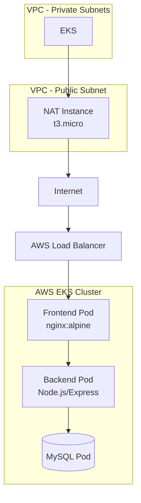

# Tienda de Alimentos para Perritos 🐶

Aplicación CRUD para gestión de productos de una tienda de alimentos para perros, desplegada en **Amazon EKS** con **CI/CD automatizado** vía GitHub Actions.

## Stack Tecnológico

| Componente | Tecnología |
|---|---|
| Frontend | HTML + JavaScript + Nginx |
| Backend | Node.js + Express |
| Base de Datos | MySQL 8 |
| Contenedores | Docker (multi-stage) |
| Orquestación | Amazon EKS (Kubernetes) |
| Infraestructura | Terraform (VPC + NAT Instance + EKS) |
| CI/CD | GitHub Actions |
| Registry | Amazon ECR |
| Monitoreo | CloudWatch Container Insights |

## Diagrama de Arquitectura



## Prerequisitos

- AWS CLI configurado con credenciales
- Terraform >= 1.3.0
- kubectl
- Docker

## Despliegue de Infraestructura

```bash
# Crear bucket S3 para estado remoto
aws s3 mb s3://tienda-perritos-terraform-state

# Inicializar y aplicar Terraform
cd terraform
terraform init
terraform plan -out=tfplan
terraform apply tfplan

# Configurar kubectl
aws eks update-kubeconfig --region us-east-1 --name prod-tienda-perritos-eks
```

## Despliegue de la Aplicación

### Local (Docker Compose)

```bash
docker-compose up --build
# Frontend: http://localhost:80
# Backend: http://localhost:3001/api/productos
```

### En EKS (automático vía CI/CD)

El pipeline de GitHub Actions se activa al hacer push a `main`:

1. **Test** - Valida que el backend arranca correctamente
2. **Build** - Construye imágenes Docker multi-etapa
3. **Push** - Publica en Amazon ECR con tag `{sha}` y `latest`
4. **Security Scan** - Escanea vulnerabilidades con Trivy
5. **Deploy** - Actualiza los deployments en EKS con `rollout restart`

## CI/CD Pipelines

| Pipeline | Archivo | Trigger |
|---|---|---|
| **Infraestructura** | `.github/workflows/deploy-infra.yml` | Push a `terraform/**` |
| **Aplicación** | `.github/workflows/deploy-app.yml` | Push al resto de archivos |

### Secrets requeridos (GitHub)

| Secret | Descripción |
|---|---|
| `AWS_ACCESS_KEY_ID` | Access key de AWS |
| `AWS_SECRET_ACCESS_KEY` | Secret key de AWS |
| `AWS_SESSION_TOKEN` | Session token (si aplica) |
| `AWS_REGION` | Región AWS (ej: us-east-1) |
| `EKS_CLUSTER_NAME` | Nombre del cluster EKS |

## Variables de Entorno

| Variable | Valor |
|---|---|
| `DB_HOST` | `tienda-db` (resolución interna en K8s) |
| `DB_USER` | `root` |
| `DB_PASSWORD` | `admin123` (via Secret) |
| `DB_NAME` | `tienda_perritos` |
| `PORT` | `3001` (backend) |

## Monitoreo

- **Container Insights** habilitado en el cluster EKS
- **CloudWatch Logs** del control plane (api, audit, scheduler)
- **Dashboard** con métricas de CPU/memoria de pods y ALB

## HPA (Autoescalado)

| Deployment | Mínimo | Máximo | Métrica |
|---|---|---|---|
| Backend | 2 pods | 10 pods | CPU > 70% |
| Frontend | 2 pods | 6 pods | CPU > 60% |

## Licencia

MIT
