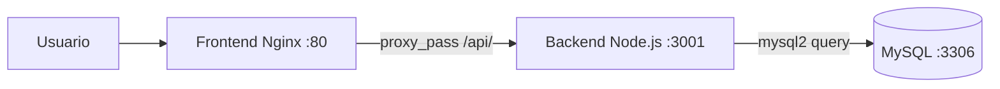
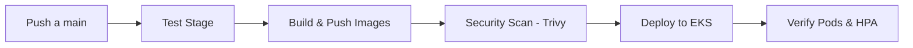

# Informe Técnico - Evaluación Final Transversal
## Tienda de Alimentos para Perritos - Despliegue en EKS

**Asignatura:** ISY1101 - Introducción a Herramientas Devops
**Estudiante:** [Nombre]
**Fecha:** Julio 2026

**URL de la aplicación desplegada:** `http://a5ce6a12d48624311a4aa23b9523e046-1353646925.us-east-1.elb.amazonaws.com`

---

## 1. Integración del Sistema

### Diagrama de Comunicación



### Flujo de Datos

1. **Frontend** (Nginx) sirve el HTML/JS estático en el puerto 80
2. **Nginx reverse proxy** redirige las rutas `/api/*` hacia el backend
3. **Backend** (Express) procesa las requests CRUD contra MySQL
4. **MySQL** almacena los productos en la tabla `productos`

### Resolución de Nombres

- En **Kubernetes**: los Services `tienda-db`, `tienda-backend` y `tienda-frontend` se resuelven vía DNS interno de K8s
- En **Docker Compose**: los nombres de servicio (`tienda-db`, `tienda-backend`) actúan como hostnames en la red `tienda-net`

---

## 2. Contenedores

### 2.1 Dockerfiles Multi-Etapa

**Backend** (`backend/Dockerfile`):
- **Stage 1 (deps)**: `node:18-alpine` - instala dependencias de producción con `npm install --production`
- **Stage 2 (runtime)**: `node:18-alpine` - copia solo `node_modules` y `server.js`

Beneficio: la imagen final solo contiene lo necesario para ejecutar, sin herramientas de compilación.

**Frontend** (`frontend/Dockerfile`):
- **Stage 1 (builder)**: `alpine:3.19` - prepara los archivos estáticos
- **Stage 2 (runtime)**: `nginx:alpine` - imagen base minimalista

### 2.2 .dockerignore

Cada servicio tiene su `.dockerignore`:
- `backend/.dockerignore`: excluye `node_modules`, `npm-debug.log`, `.git`
- `frontend/.dockerignore`: excluye `.git`, `*.md`
- `db/.dockerignore`: excluye `.git`, `*.md`

### 2.3 Orquestación Local

`docker-compose.yml` define 3 servicios con red interna `tienda-net`:
- `db`: MySQL 8 con healthcheck, volumen persistente
- `backend`: Node.js, depende de `db` (espera healthcheck)
- `frontend`: Nginx, depende de `backend`

---

## 3. Registro de Imágenes

### Amazon ECR

Terraform crea 3 repositorios ECR privados:
- `prod-tienda-perritos-frontend-repo`
- `prod-tienda-perritos-backend-repo`
- `prod-tienda-perritos-db-repo`

### Estrategia de Etiquetado (Tags)

Cada build produce **dos tags**:
| Tag | Propósito |
|---|---|
| `v{run_number}-{sha}` (ej: `v9-cc470c63e5af24a3a`) | Trazabilidad: número de ejecución + SHA completo del commit |
| `latest` | Última versión disponible |

El pipeline ejecuta:
```bash
docker build -t $REGISTRY/$REPO:$SHA .
docker tag $REGISTRY/$REPO:$SHA $REGISTRY/$REPO:latest
docker push $REGISTRY/$REPO:$SHA
docker push $REGISTRY/$REPO:latest
```

### Política de Ciclo de Vida (Lifecycle Policy)

- Mantener últimas 10 imágenes con tag `v*`
- Eliminar imágenes sin tag después de 7 días

---

## 4. CI/CD

### 4.1 Pipeline de Infraestructura

**Archivo:** `.github/workflows/deploy-infra.yml`

```mermaid
graph LR
    Push[Push a main] -->|terraform/**| Checkout
    Checkout --> AWS[Configure AWS Credentials]
    AWS --> TFSetup[Setup Terraform]
    TFSetup --> Init[terraform init]
    Init --> Validate[terraform validate]
    Validate --> Plan[terraform plan]
    Plan --> Apply[terraform apply]
    Apply --> Outputs[Obtener outputs]
```



**Trigger:** Solo cuando cambian archivos en `terraform/`

### 4.2 Pipeline de Aplicación

**Archivo:** `.github/workflows/deploy-app.yml`



**Etapas:**
1. **Test**: valida que el servidor Node.js arranca y que los Dockerfiles existen
2. **Build & Push**: construye imágenes multi-etapa, tag con SHA + latest, publica en ECR
3. **Security Scan**: escanea vulnerabilidades HIGH/CRITICAL con Trivy
4. **Deploy**: aplica manifests K8s, actualiza imágenes con `kubectl set image`, verifica rollout
5. **Verify**: muestra estado de pods, servicios y HPA

---

## 5. Infraestructura en la Nube

### 5.1 Arquitectura AWS

```
Internet
    │
    ▼
┌─────────────────────────────┐
│     Internet Gateway        │
└─────────────────────────────┘
    │
┌─────────────────────────────┐
│   Public Subnet (us-east-1a)│
│   ┌─────────────────────┐   │
│   │   NAT Instance       │   │
│   │   (t3.micro, EIP)    │   │
│   └─────────────────────┘   │
└─────────────────────────────┘
    │
┌─────────────────────────────┐
│   Private Subnet (us-east-1a)│
│   ┌─────────────────────┐   │
│   │   EKS Cluster        │   │
│   │   Node Group         │   │
│   │   t3.medium x2       │   │
│   └─────────────────────┘   │
└─────────────────────────────┘
┌─────────────────────────────┐
│   Private Subnet (us-east-1b)│
│   ┌─────────────────────┐   │
│   │   EKS Cluster        │   │
│   │   Node Group         │   │
│   └─────────────────────┘   │
└─────────────────────────────┘
```

### 5.2 Componentes

| Recurso | Descripción |
|---|---|
| **VPC** | `10.0.0.0/16` con DNS habilitado |
| **Subnets Públicas** | 2 subnets (una por AZ) con IGW |
| **Subnets Privadas** | 2 subnets (una por AZ) para EKS |
| **NAT Instance** | EC2 t3.micro con Amazon Linux 2, EIP, iptables MASQUERADE |
| **EKS Cluster** | Kubernetes 1.31 con API pública + privada |
| **Managed Node Group** | t3.medium, 1-5 nodos, ON_DEMAND |
| **Security Groups** | Puertos mínimos expuestos, solo tráfico necesario |

### 5.3 NAT Instance

Se utiliza una **NAT Instance** en lugar de AWS NAT Gateway por:
- **Costo**: una NAT Gateway cuesta ~$32/mes; una t3.micro cuesta ~$8/mes
- **Control total**: acceso SSH para troubleshooting
- **Personalización**: se pueden agregar reglas de iptables adicionales

El módulo `terraform-aws-nat-instance` configura:
- Amazon Linux 2 con `iptables-services`
- Regla `MASQUERADE` para tráfico saliente
- `ip_forward = 1` en el kernel
- Elastic IP persistente

---

## 6. Configuración y Secretos

### 6.1 Estrategia de Gestión

| Secreto | Dónde se almacena | Acceso |
|---|---|---|
| `AWS_ACCESS_KEY_ID` | GitHub Secrets | Solo pipeline CI/CD |
| `AWS_SECRET_ACCESS_KEY` | GitHub Secrets | Solo pipeline CI/CD |
| `AWS_SESSION_TOKEN` | GitHub Secrets | Solo pipeline CI/CD |
| `MYSQL_ROOT_PASSWORD` | K8s Secret (`mysql-secret`) | Solo pod de MySQL |
| `DB_HOST`, `DB_USER`, etc. | Env vars del Deployment | Solo contenedor backend |

### 6.2 Principio de Mínimo Privilegio (IAM)

Los roles IAM son pre-existentes en la cuenta de laboratorio (no se crean desde Terraform por restricciones de permisos `iam:CreateRole`). Se referencian mediante `data sources` de Terraform:

| Rol | Nombre Real | Políticas Adjuntas |
|---|---|---|
| **EKS Cluster Role** | `LabEksClusterRole-*` | `AmazonEKSClusterPolicy` |
| **EKS Node Role** | `LabEksNodeRole-*` | `AmazonEKSWorkerNodePolicy` + `AmazonEKS_CNI_Policy` + `AmazonEC2ContainerRegistryReadOnly` |

> **Nota:** No se adjuntó `CloudWatchAgentServerPolicy` porque `iam:AttachRolePolicy` está denegado en el entorno de laboratorio. Como consecuencia, Container Insights no pudo habilitarse (ver §9).

### 6.3 K8s Secrets

La contraseña de MySQL se almacena en un Secret de Kubernetes codificado en base64 y se inyecta como variable de entorno:

```yaml
apiVersion: v1
kind: Secret
metadata:
  name: mysql-secret
type: Opaque
data:
  MYSQL_ROOT_PASSWORD: YWRtaW4xMjM=  # "admin123" en base64
```

El backend accede a esta contraseña via `secretKeyRef` en el Deployment.

---

## 7. Seguridad Básica

### 7.1 Endurecimiento de Imágenes

| Práctica | Aplicación |
|---|---|
| **Imágenes base minimalistas** | `node:18-alpine`, `nginx:alpine`, `mysql:8` |
| **Multi-stage** | Backend usa builder + runtime, solo copia lo necesario |
| **Escaneo de vulnerabilidades** | Trivy en el pipeline CI/CD (HIGH/CRITICAL) |
| **Sin herramientas de compilación** | Las imágenes finales no contienen compiladores ni gestores de paquetes |

### 7.2 Puertos Mínimos Expuestos

| Servicio | Puerto | Expuesto a |
|---|---|---|
| Frontend | 80 (HTTP) | Internet vía ALB |
| Backend | 3001 | Solo dentro del cluster (ClusterIP) |
| MySQL | 3306 | Solo dentro del cluster (Headless Service) |
| NAT Instance SSH | 22 | Deshabilitado (no se expone) |

### 7.3 Security Groups

Las reglas de los Security Groups son restrictivas:
- **NAT Instance SG**: solo permite TCP/UDP/ICMP desde CIDRs de subnets privadas (10.0.0.0/16). Puertos: todos los tráficos salientes habilitados, entrantes solo desde VPC.
- **EKS Cluster SG**: gestionado automáticamente por EKS, permite tráfico entre nodos y control plane en los puertos necesarios (443, 10250, 53, etc.). No se exponen puertos SSH (22) en ningún recurso.
- **Load Balancer SG**: el ALB expone únicamente el puerto 80 (HTTP) hacia Internet, y se comunica con los pods del frontend en el puerto 31222 (NodePort).

---

## 8. Orquestación y Escalabilidad

### 8.1 ¿Por qué EKS?

| Aspecto | Amazon EKS | Despliegue Manual (EC2) |
|---|---|---|
| **Autoescalado** | HPA escala pods automáticamente | Requiere scripts manuales |
| **Auto-reparación** | Recrea pods caídos automáticamente | Requiere monitoreo manual |
| **Rolling updates** | Actualizaciones sin downtime con `rollout` | Downtime forzado |
| **Service Discovery** | DNS interno para comunicación entre servicios | Configuración manual |
| **Load Balancing** | ALB integrado con servicios K8s | Configuración manual de ELB |

### 8.2 Autoescalado (HPA)

| Deployment | Replicas Base | Máximo | Métrica de escalado |
|---|---|---|---|
| `tienda-backend` | 2 | 10 | CPU > 70% |
| `tienda-frontend` | 2 | 6 | CPU > 60% |

El **Metrics Server** add-on recolecta métricas de CPU/memoria cada 15 segundos, permitiendo que el HPA reaccione rápidamente a cambios de carga.

### 8.3 Alta Disponibilidad

- **Multi-AZ**: el cluster EKS se despliega en 2 zonas de disponibilidad
- **Múltiples réplicas**: cada servicio tiene al menos 2 réplicas
- **Health checks**: readinessProbe + livenessProbe en cada deployment

---

## 9. Monitoreo

### 9.1 CloudWatch Logs (Control Plane)

El control plane de EKS envía logs a CloudWatch automáticamente:
- Log group: `/aws/eks/prod-tienda-perritos-eks/cluster`
- Logs habilitados: `api`, `audit`, `authenticator`, `controllerManager`, `scheduler`
- Retención: 7 días

### 9.2 Container Insights (No disponible por restricciones IAM)

Container Insights permite visualizar métricas de CPU, memoria, red y disco de pods y nodos. Sin embargo, en este entorno de laboratorio **no fue posible habilitarlo** debido a las siguientes restricciones IAM:

| Requisito | Problema |
|---|---|
| `iam:CreateRole` | Denegado — no se puede crear rol para el CloudWatch agent |
| `iam:AttachRolePolicy` | Denegado — no se puede adjuntar `CloudWatchAgentServerPolicy` al rol de nodo |
| OIDC Provider | No existe en la cuenta |

Como alternativa, se utiliza **Metrics Server** (instalado como add-on de EKS) para monitorear métricas de CPU/memoria desde kubectl:

```bash
kubectl top pods -n tienda
kubectl top nodes
```

### 9.3 Logs del Pipeline (GitHub Actions)

Cada ejecución del pipeline `deploy-app.yml` queda registrada en GitHub Actions con logs detallados de cada etapa (test, build, push, security scan, deploy), accesibles desde la pestaña Actions del repositorio.

> **Nota:** No se implementó un dashboard de CloudWatch porque Container Insights no está disponible (ver §9.2). Las métricas se consultan via `kubectl top` y los logs del control plane se visualizan desde CloudWatch Logs.

---

## 10. Conclusiones

La implementación de esta solución demuestra la automatización completa del ciclo de vida de una aplicación usando herramientas DevOps:

1. **Infraestructura como Código**: Terraform permite replicar toda la infraestructura de AWS (VPC, NAT, EKS, ECR) de forma declarativa y versionada
2. **Contenerización**: Docker con multi-stage produce imágenes minimalistas y seguras
3. **CI/CD Automatizado**: GitHub Actions orquesta build, test, security scan, push y deploy sin intervención manual
4. **Orquestación**: EKS con HPA garantiza disponibilidad y escalabilidad automática
5. **Seguridad**: Imágenes base ligeras, escaneo de vulnerabilidades, secretos cifrados y políticas IAM de mínimo privilegio
6. **Observabilidad**: CloudWatch proporciona logs y métricas para monitorear el estado del sistema

**Próximos pasos sugeridos:**
- Implementar Helm charts para simplificar el manejo de manifests K8s
- Agregar un pipeline de destroy automatizado (ya incluido)
- Implementar GitOps con ArgoCD o Flux
- Agregar tests de integración con Postman/Newman en el pipeline
